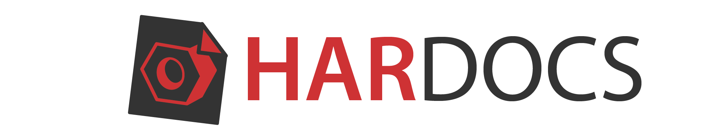
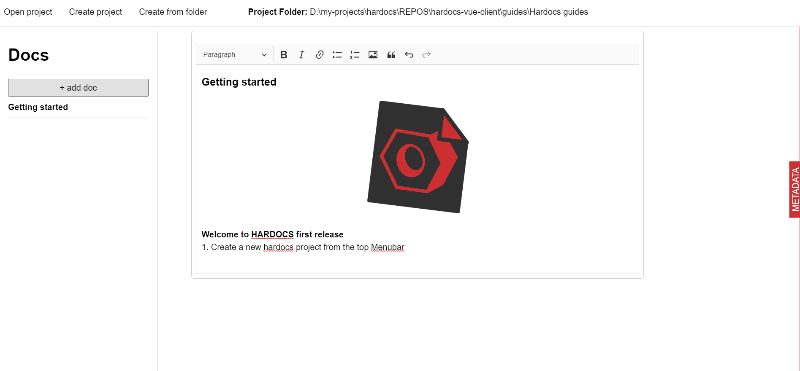

<!--
*** Thanks for checking out the Best-README-Template. If you have a suggestion
*** that would make this better, please fork the repo and create a pull request
*** or simply open an issue with the tag "enhancement".
*** Thanks again! Now go create something AMAZING! :D
-->

<!-- PROJECT SHIELDS -->
<!--
*** I'm using markdown "reference style" links for readability.
*** Reference links are enclosed in brackets [ ] instead of parentheses ( ).
*** See the bottom of this document for the declaration of the reference variables
*** for contributors-url, forks-url, etc. This is an optional, concise syntax you may use.
*** https://www.markdownguide.org/basic-syntax/#reference-style-links
-->
[![Contributors][contributors-shield]][contributors-url]
[![Forks][forks-shield]][forks-url]
[![Stargazers][stars-shield]][stars-url]
[![Issues][issues-shield]][issues-url]
[![GPL v2][license-shield]][license-url]

<!-- PROJECT LOGO -->
 

  

  <h3 align="center">Make project documentations easily</h3>

  

    Designed with hardware documentation in mind
     
    <a href="https://github.com/Hardocs/desktop-app/releases"><strong>Download the app »</strong></a>
     
     
    <a href="https://hardocs.github.io">Project website</a>
    ·
    <!-- <a href="https://github.com/Hardocs/desktop-app/issues">Report Bug</a>
    ·
    <a href="https://github.com/Hardocs/desktop-app/issues">Request Feature</a>  -->
  

<!-- TABLE OF CONTENTS -->

  
Table of Contents

  <ol>
    <li>
      <a href="#about-the-project">About The Project</a>
      <ul>
        <li><a href="#built-with">Built With</a></li>
      </ul>
    </li>
    <li>
      <a href="#getting-started">Getting Started</a>
      <ul>
        <li><a href="#installation">Installation</a></li>
      </ul>
    </li>
    <li><a href="#usage">Usage</a></li>
    <li><a href="#roadmap">Roadmap</a></li>
    <li><a href="#contributing">Contributing</a></li>
    <li><a href="#license">License</a></li>
    <li><a href="#contact">Contact</a></li>
    <li><a href="#acknowledgements">Acknowledgements</a></li>
  </ol>

<!-- ABOUT THE PROJECT -->
## About The Project

There are already many good solutions to document projects on the cloud, but we wanted to develop a solution that is local first and offline first, allows you easily generate documents within folders and projects and work easily with images.

**Why to use it**
* Prepare your project documentation as a set of documents that relate with each other.
* Create html documents in a simple and straightforward way. 
* Edit tables easily.
* Work with text images intuitively, what you see is what you get. 

### Built With

Hardocs is a hybrid desktop application that uses web technologies done in javascript. 
* [Vuejs](https://vuejs.org/)
* [Tailwind](https://tailwindcss.com/)
* [Electron](https://www.electronjs.org/)
* [Ckeditor-5](https://ckeditor.com/ckeditor-5/)

<!-- GETTING STARTED -->
## Getting Started

### Installation

- [Download the version for your operating system](https://github.com/Hardocs/desktop-app/releases).

<!-- ROADMAP -->
## Roadmap

See the [open issues](https://github.com/Hardocs/desktop-app/issues) for a list of proposed features (and known issues).

- Metadata reader and editor.
- Selection of metadata standards specified in JSON schemas.
- Pandoc integration to import and export different document formats (pdfs, epubs, markdown, etc.).
- Local database listing users project.
- Cloud database to collaborate and share your documents databases.

<!-- CONTRIBUTING -->
## Contributing

Contributions are what make the open source community such an amazing place to be learn, inspire, and create. Any contributions you make are **greatly appreciated**.

1. Download the app and give it a try.
2. Take our [usability survey](https://docs.google.com/forms/d/e/1FAIpQLSfbYJWQY6nNiOPkqy04jhKPzIBVoOE3jMptKHTk-Q5KS4B1PQ/viewform) to get your feedback.
3. Read our extended [contribution guidelines](https://hardocs.github.io/04-contribute/#for-users)

<!-- LICENSE -->
## License

Distributed under the MIT License. See `LICENSE` for more information.

<!-- CONTACT -->
## Contact

Jose Carlos Urra Llanusa - [@jurra](https://github.com/jurra) - j.c.urrallanusa@tudelft.nl

<!-- ACKNOWLEDGEMENTS -->
## Acknowledgements
* [Delft Open Hardware](https://delftopenhardware.nl/)
* [EOSC secretariat](https://www.eoscsecretariat.eu/)
* [European Open Science Cloud (EOSC)](https://www.eosc-portal.eu/)
* [TU Delft](https://www.tudelft.nl/en/)

<!-- MARKDOWN LINKS & IMAGES -->
<!-- https://www.markdownguide.org/basic-syntax/#reference-style-links -->
[contributors-shield]: https://img.shields.io/github/contributors/Hardocs/desktop-app.svg?style=for-the-badge
[contributors-url]: https://github.com/Hardocs/desktop-app/graphs/contributors
[forks-shield]: https://img.shields.io/github/forks/Hardocs/desktop-app.svg?style=for-the-badge
[forks-url]: https://github.com/Hardocs/desktop-app/network/members
[stars-shield]: https://img.shields.io/github/stars/Hardocs/desktop-app.svg?style=for-the-badge
[stars-url]: https://github.com/Hardocs/desktop-app/stargazers
[issues-shield]: https://img.shields.io/github/issues/Hardocs/desktop-app.svg?style=for-the-badge
[issues-url]: https://github.com/Hardocs/desktop-app/issues
[license-shield]: https://img.shields.io/github/license/Hardocs/desktop-app.svg?style=for-the-badge
[license-url]: https://github.com/Hardocs/desktop-app/blob/master/LICENSE.txt
[linkedin-shield]: https://img.shields.io/badge/-LinkedIn-black.svg?style=for-the-badge&logo=linkedin&colorB=555
[linkedin-url]: https://linkedin.com/in/othneildrew
[product-screenshot]: images/screenshot.png
